# Campus Resource Hub - Entity Relationship Diagram (ERD)

This document contains the Entity Relationship Diagram for the Campus Resource Hub database schema, showing all tables, their attributes, and relationships.

## How to View the Diagram

### Option 1: View on GitHub
This diagram will automatically render when viewing this file on GitHub.

### Option 2: Use mermaid.live
1. Copy **ONLY** the code between the triple backticks (lines 9-158 below)
2. Go to https://mermaid.live
3. Paste the code into the editor
4. The diagram will render automatically

**Important**: Do NOT copy the markdown header (`# Campus Resource Hub...`) or the code fence markers (```mermaid and ```). Only copy the actual mermaid code starting with `erDiagram`.

### Option 3: Use the standalone file
A standalone `.mmd` file (`ERD_Diagram.mmd`) is also available in this directory that contains only the mermaid code with no markdown formatting.

## ERD Diagram

```mermaid
erDiagram
    users ||--o{ resources : owns
    users ||--o{ bookings : makes
    users ||--o{ reviews : writes
    users ||--o{ messages : sends
    users ||--o{ messages : receives
    users ||--o{ notifications : receives
    users ||--o{ waitlist : joins
    users ||--o{ admin_logs : performs
    users ||--o{ calendar_subscriptions : subscribes
    
    resources ||--o{ bookings : booked_in
    resources ||--o{ reviews : reviewed_in
    resources ||--o{ resource_images : has
    resources ||--o{ waitlist : waitlisted_for
    resources ||--o{ notifications : related_to
    
    bookings ||--o{ bookings : parent_of
    bookings ||--o{ notifications : generates
    
    users {
        int id PK
        string email UK "VARCHAR(120) UNIQUE NOT NULL"
        string username UK "VARCHAR(80) UNIQUE NOT NULL"
        string password_hash "VARCHAR(128) NOT NULL"
        string first_name "VARCHAR(50) NULL"
        string last_name "VARCHAR(50) NULL"
        string department "VARCHAR(100) NULL"
        string role "VARCHAR(20) DEFAULT student"
        boolean is_active "DEFAULT TRUE"
        boolean is_suspended "DEFAULT FALSE NOT NULL"
        text suspension_reason "NULL"
        datetime created_at "DEFAULT CURRENT_TIMESTAMP"
    }
    
    resources {
        int id PK
        string title "VARCHAR(100) NOT NULL"
        string name "VARCHAR(100) NULL Legacy column"
        text description "NULL"
        string category "VARCHAR(50) NOT NULL"
        string type "VARCHAR(50) NULL Legacy column"
        string location "VARCHAR(100) NULL"
        string image_url "VARCHAR(255) NULL Legacy deprecated"
        int capacity "NULL"
        int owner_id FK "NULL Foreign key to users.id"
        boolean is_available "DEFAULT TRUE"
        boolean is_featured "DEFAULT FALSE"
        boolean requires_approval "DEFAULT FALSE NOT NULL"
        string status "VARCHAR(20) DEFAULT draft NOT NULL Values: draft published archived"
        text equipment "NULL Comma-separated list"
        datetime created_at "DEFAULT CURRENT_TIMESTAMP"
        datetime updated_at "DEFAULT CURRENT_TIMESTAMP ON UPDATE"
    }
    
    bookings {
        int id PK
        int user_id FK "NOT NULL Foreign key to users.id"
        int resource_id FK "NOT NULL Foreign key to resources.id"
        datetime start_date "NOT NULL"
        datetime end_date "NOT NULL"
        datetime start_time "NULL Legacy column"
        datetime end_time "NULL Legacy column"
        string status "VARCHAR(20) DEFAULT pending Values: pending active completed cancelled"
        text notes "NULL"
        string recurrence_type "VARCHAR(20) NULL Values: daily weekly monthly"
        datetime recurrence_end_date "NULL End date for recurrence series"
        int parent_booking_id FK "NULL Self-referential foreign key to bookings.id"
        datetime created_at "DEFAULT CURRENT_TIMESTAMP"
        datetime updated_at "DEFAULT CURRENT_TIMESTAMP ON UPDATE"
    }
    
    reviews {
        int id PK
        int user_id FK "NOT NULL Foreign key to users.id"
        int resource_id FK "NOT NULL Foreign key to resources.id"
        int rating "NOT NULL Range: 1-5"
        text review_text "NULL"
        boolean is_hidden "DEFAULT FALSE NOT NULL"
        datetime created_at "DEFAULT CURRENT_TIMESTAMP NOT NULL"
        datetime updated_at "DEFAULT CURRENT_TIMESTAMP ON UPDATE NOT NULL"
    }
    
    messages {
        int id PK
        int sender_id FK "NOT NULL Foreign key to users.id"
        int recipient_id FK "NOT NULL Foreign key to users.id"
        string subject "VARCHAR(200) NOT NULL"
        text body "NOT NULL"
        boolean is_read "DEFAULT FALSE NOT NULL"
        boolean is_flagged "DEFAULT FALSE NOT NULL"
        boolean is_hidden "DEFAULT FALSE NOT NULL"
        text flag_reason "NULL"
        datetime created_at "DEFAULT CURRENT_TIMESTAMP NOT NULL"
    }
    
    notifications {
        int id PK
        int user_id FK "NOT NULL Foreign key to users.id"
        string type "VARCHAR(50) NOT NULL Values: booking_created approved rejected cancelled modified recurring_series waitlist_available owner_notified"
        string title "VARCHAR(200) NOT NULL"
        text message "NOT NULL"
        int related_booking_id FK "NULL Foreign key to bookings.id"
        int related_resource_id FK "NULL Foreign key to resources.id"
        boolean is_read "DEFAULT FALSE NOT NULL"
        datetime created_at "DEFAULT CURRENT_TIMESTAMP NOT NULL"
    }
    
    waitlist {
        int id PK
        int user_id FK "NOT NULL Foreign key to users.id"
        int resource_id FK "NOT NULL Foreign key to resources.id"
        datetime requested_start_date "NOT NULL"
        datetime requested_end_date "NOT NULL"
        string status "VARCHAR(20) DEFAULT pending Values: pending notified cancelled"
        text notes "NULL"
        datetime created_at "DEFAULT CURRENT_TIMESTAMP NOT NULL"
        datetime notified_at "NULL"
    }
    
    admin_logs {
        int log_id PK "AUTO_INCREMENT"
        int admin_id FK "NOT NULL Foreign key to users.id"
        text action "NOT NULL"
        text target_table "NULL"
        text details "NULL"
        datetime timestamp "DEFAULT CURRENT_TIMESTAMP NOT NULL"
    }
    
    resource_images {
        int id PK
        int resource_id FK "NOT NULL Foreign key to resources.id Cascade delete"
        string image_path "VARCHAR(255) NOT NULL"
        int display_order "DEFAULT 0 NOT NULL"
        datetime created_at "DEFAULT CURRENT_TIMESTAMP NOT NULL"
    }
    
    calendar_subscriptions {
        int id PK
        int user_id FK "NOT NULL Foreign key to users.id"
        string token UK "VARCHAR(64) UNIQUE NOT NULL INDEX"
        datetime created_at "DEFAULT CURRENT_TIMESTAMP NOT NULL"
        datetime last_accessed_at "NULL"
        int access_count "DEFAULT 0 NOT NULL"
        boolean is_active "DEFAULT TRUE NOT NULL"
        datetime expires_at "NULL Optional expiration"
        string status_filter "VARCHAR(20) NULL Values: active pending etc"
        datetime start_date "NULL Optional start date filter"
        datetime end_date "NULL Optional end date filter"
    }
```



## Relationship Summary

### One-to-Many Relationships

1. **users → resources** (via `owner_id`)
   - One user can own many resources
   - Relationship: `users.id` ← `resources.owner_id`

2. **users → bookings** (via `user_id`)
   - One user can make many bookings
   - Relationship: `users.id` ← `bookings.user_id`

3. **users → reviews** (via `user_id`)
   - One user can write many reviews
   - Relationship: `users.id` ← `reviews.user_id`

4. **users → messages** (as sender via `sender_id`)
   - One user can send many messages
   - Relationship: `users.id` ← `messages.sender_id`

5. **users → messages** (as recipient via `recipient_id`)
   - One user can receive many messages
   - Relationship: `users.id` ← `messages.recipient_id`

6. **users → notifications** (via `user_id`)
   - One user can receive many notifications
   - Relationship: `users.id` ← `notifications.user_id`

7. **users → waitlist** (via `user_id`)
   - One user can have many waitlist entries
   - Relationship: `users.id` ← `waitlist.user_id`

8. **users → admin_logs** (via `admin_id`)
   - One admin user can perform many logged actions
   - Relationship: `users.id` ← `admin_logs.admin_id`

9. **users → calendar_subscriptions** (via `user_id`)
   - One user can have many calendar subscriptions
   - Relationship: `users.id` ← `calendar_subscriptions.user_id`

10. **resources → bookings** (via `resource_id`)
    - One resource can have many bookings
    - Relationship: `resources.id` ← `bookings.resource_id`

11. **resources → reviews** (via `resource_id`)
    - One resource can have many reviews
    - Relationship: `resources.id` ← `reviews.resource_id`

12. **resources → resource_images** (via `resource_id`)
    - One resource can have many images
    - Relationship: `resources.id` ← `resource_images.resource_id`
    - Cascade delete: images are deleted when resource is deleted

13. **resources → waitlist** (via `resource_id`)
    - One resource can have many waitlist entries
    - Relationship: `resources.id` ← `waitlist.resource_id`

14. **resources → notifications** (via `related_resource_id`)
    - One resource can be related to many notifications
    - Relationship: `resources.id` ← `notifications.related_resource_id`

15. **bookings → notifications** (via `related_booking_id`)
    - One booking can generate many notifications
    - Relationship: `bookings.id` ← `notifications.related_booking_id`

### Self-Referential Relationships

1. **bookings → bookings** (via `parent_booking_id`)
   - One booking can be the parent of many child bookings (recurring series)
   - Relationship: `bookings.id` ← `bookings.parent_booking_id`
   - Self-referential relationship for handling recurring bookings

## Key Constraints

### Unique Constraints
- `users.email` - UNIQUE
- `users.username` - UNIQUE
- `calendar_subscriptions.token` - UNIQUE

### Foreign Key Constraints
- All foreign keys maintain referential integrity
- `resource_images` has cascade delete on resource deletion

### Business Rules
- User roles: 'student', 'staff', 'admin'
- Resource status: 'draft', 'published', 'archived'
- Booking status: 'pending', 'active', 'completed', 'cancelled'
- Review ratings: 1-5
- Waitlist status: 'pending', 'notified', 'cancelled'

## Notes

- **Legacy Columns**: The `resources` table includes `name` and `type` columns for backward compatibility with existing database schema. These are nullable and populated from `title` and `category` respectively.
- **Recurring Bookings**: The `bookings` table supports recurring bookings through the `parent_booking_id` self-referential relationship. Parent bookings have `recurrence_type` and `recurrence_end_date` set, while child bookings reference their parent.
- **Image Storage**: Resources can have multiple images via the `resource_images` table. The legacy `image_url` column in `resources` is deprecated but maintained for backward compatibility.

